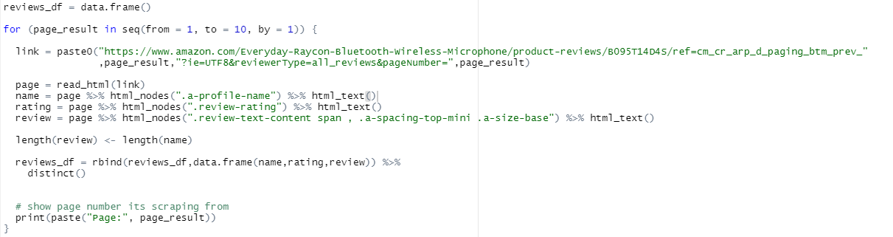

# Web-Scraping-with-R-Studio
Example using Amazon reviews, but will work for most sites

<!-- TABLE OF CONTENTS -->

  
Table of Contents

  <ol>
    <li>
      <a href="#about-the-project">About The Project</a>
      </ul>
    </li>
    <li>
      <a href="#web-scraping">Web Scraping</a>
      <ul>
        <li><a href="#nodes-method">Nodes Method</a></li>
        <li><a href="#selector-gadget-method">Selector Gadget Method</a></li>
        <li><a href="#xpath-method">Xpath Method</a></li>
        <li><a href="#columns">Columns</a></li>
      </ul>
  </ol>

## About the Project
Web scraping tutorial using R studio. This will be done on Amazon review data but will work for most sites not needing API acess. Here we will be getting data on the reviewer's name, the star rating they gave and actual reveiw they wrote.

## Web Scraping
We will look at two diffirent ways to create our data: nodes and xpath. They do the same thing, but our two diffirent ways of writing the code and organizing it.

### Nodes Method

  

We first create the data frame that the data were scraping will be placed into. For the URL of the webtsite, in this case the amazon reviews you will notice generally as you go to the next page of the reviews the url will change slightly. For the amazon reviews you can see that there are two instances where the url changes and those changes correspond to the page number its in. So what we do is make that a variable, in his case we name it `page_result` so that we can run it for however many pages of reviews we want. In the example we will get the first 10 pages of reviews.

  

Now we press `f12` to open the site source code and press the inspect element button (top left button of a square with arrow in it). Now to we drag it over to the top of the reviewers username and click it. You should see this information pop up and the text we want is the class name `a-profile-name`. In our R code make sure to put place a . before the name in order for the code to work so now its `.a-profile-name`.

### Selector Gadget

  

Now sometimes using the f12 method won't give the correct name that we want. Sometimes we won't be able to tell right off the bat until we try it on R. Whenever we use any of the span names from the html source of the star ratings in the review, we won't get any result in R. A work around this is using `selector gadget`, a free chrome extention tool.

  

When using selector gadget we click on the item we want, in this case the stars and deleselect the ones we don't want if we need to. Now all the stars in the review should be highlighted yellow and in the textbox we get the result of `.review-rating` which will now work in the R code.

### Xpath Method
The other R file will look at another method, a bit more work as we have to be a little more specific in the code will be the Xpath method. But this method also will be more accurate and will work more correctly then the nodes method for most of the cases.

###Columns
